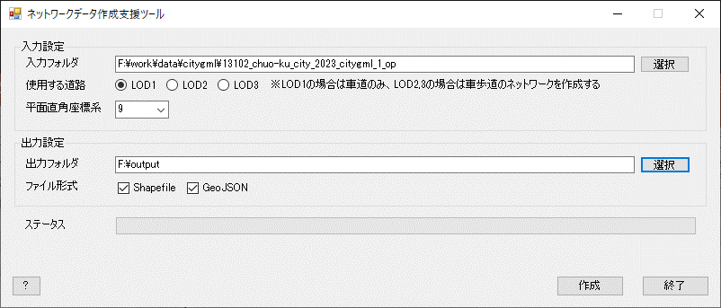

# ネットワークデータ作成支援ツール

## 1.概要

本リポジトリでは、FY2024のProject PLATEAUにおいて開発した「ネットワークデータ作成支援ツール」（以下、「本ツール」という。）のソースコードを公開しています。

## 2.「ネットワークデータ作成支援ツールの開発」について

3D都市モデルのユースケースでは、防災やまちづくり等の都市全体を対象とした解析やシミュレーションが特に実装されつつあります。これらのユースケースでは3D都市モデルのデータだけでなく、歩行者や車両の動態シミュレーションにネットワークデータが必要となります。従来、これらのネットワークデータは3D都市モデル（交通（道路））から手作業で抽出・成形されることが多く、そのコストが課題となっています。 \
「ネットワークデータ作成支援ツール」は、この課題の解決を目的に国土交通省都市局が開発したツールです。

交通シミュレーションで使用する道路ネットワークは以下の4レベルに分類されます。 \
本ツールが作成するネットワークデータは、メソレベル（広域シミュレーション向けデータ）に該当します。

| レベル | 説明 |
| - | - |
| マクロ | ノードと方向別リンクのトポロジ（グラフ表現）データ |
| メソ | マクロレベルの情報に実空間座標（XYZ）が追加されたデータ |
| ミクロ | メソレベルの情報に道路空間形状と車線構成情報が追加されたデータ |
| ナノ | ミクロレベルの情報に路面形状、3Dビジュアル情報が追加されたデータ |

本ツールの詳細については[技術検証レポート](XXX)を参照してください。

## 3. 利用手順 <!-- 下記の通り、GitHub Pagesへリンクを記載ください。URLはアクセンチュアにて設定しますので、サンプルそのままでOKです。 -->

本ツールの構築手順及び利用手順については[利用チュートリアル](XXX)を参照してください。

## 4. システム概要

- 3D都市モデル（交通（道路）、都市設備、橋梁）を使用して、車道及び歩道ネットワークデータ（ノードデータ、リンクデータ）を作成します。
- 作成したネットワークデータにおいてリンクが作成できなかった等のエラーが発生している地点の情報をCSVファイルに出力します。

## 5. 利用技術

| ライブラリ名称 | ライセンス | バージョン | 内容 |
| - | - | - | - |
| [Boost C++ Libraries](https://www.boost.org/) | [Boost Software License ver.1.0](https://www.boost.org/users/license.html) | 1.85.0 | 幾何計算ライブラリ |
| [GDAL/OGR](https://gdal.org/) | MIT | 3.9.1 | 地理空間データフォーマットの変換ライブラリ |
| [libplateau](https://github.com/Project-PLATEAU/libplateau) | GNU Lesser General Public License v2.1 | 016e4af2 | PLATEAUの3D都市モデルを扱うためのライブラリ |
| [OpenCV, OpenCV contrib](https://opencv.org/) | Apache-2.0 | 4.10.0 | 画像処理ライブラリ |
| [spdlog](https://github.com/gabime/spdlog) | MIT | 3.9.1 | ログ出力ライブラリ |

## 6. 動作環境 <!-- 動作環境についての仕様を記載ください。 -->

【LOD1、LOD2交通（道路）モデルからネットワークを作成する場合】

| 項目 | 最小動作環境 | 推奨動作環境 |
| - | - | - |
| OS | Microsoft Windows 10 または 11 | 同左 |
| CPU | Intel Core i5以上 | Intel Core i7以上 |
| メモリ | 8GB以上 | 16GB以上 |
| ネットワーク | 不要 |  同左 |

【LOD3交通（道路）モデルからネットワークを作成する場合】

| 項目 | 最小動作環境 | 推奨動作環境 |
| - | - | - |
| OS | Microsoft Windows 10 または 11 | 同左 |
| CPU | Intel Core i7以上 | 同左 |
| メモリ | 16GB以上 | 同左 |
| ネットワーク | 不要 |  同左 |

## 7. ライセンス

- ソースコードおよび関連ドキュメントの著作権は国土交通省に帰属します。
- 本ドキュメントは[Project PLATEAUのサイトポリシー](https://www.mlit.go.jp/plateau/site-policy/)（CCBY4.0および政府標準利用規約2.0）に従い提供されています。

## 8. 注意事項

- 本リポジトリは参考資料として提供しているものです。動作保証は行っていません。
- 本リポジトリについては予告なく変更又は削除をする可能性があります。
- 本リポジトリの利用により生じた損失及び損害等について、国土交通省はいかなる責任も負わないものとします。

## 9. 参考資料

- 技術検証レポート: XXX
