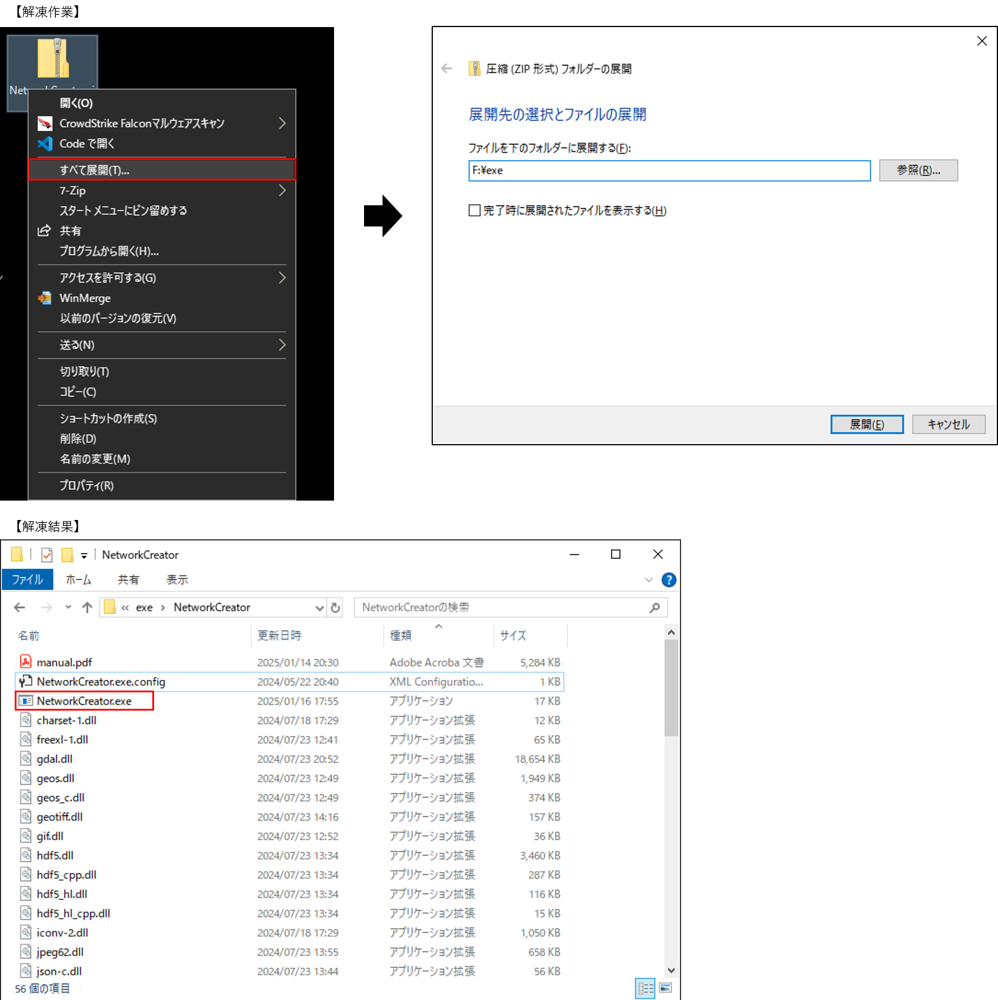
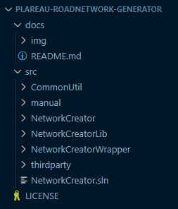
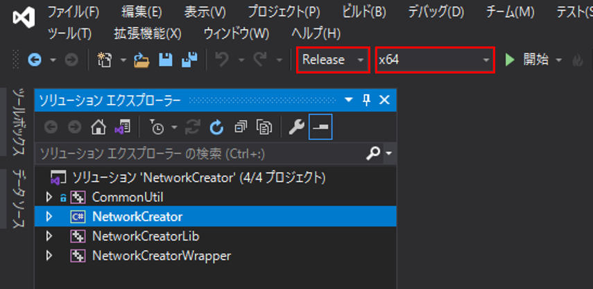
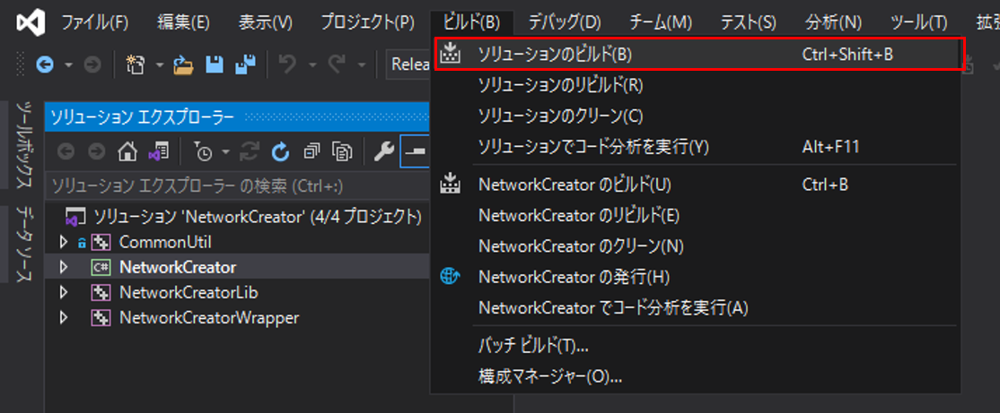
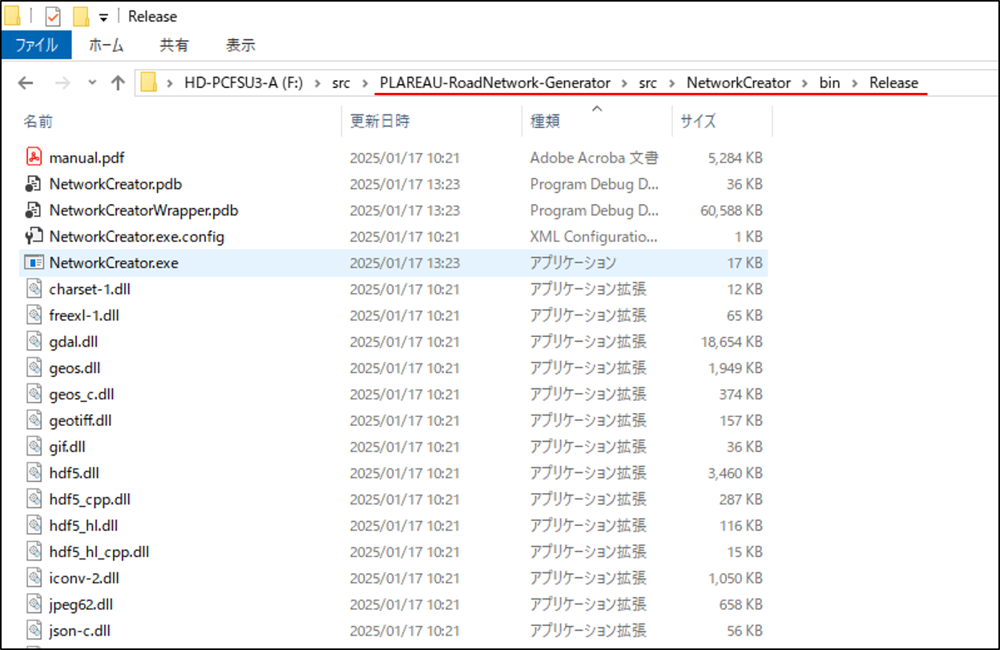

# 環境構築手順書

## 1 本書について

本書では、3D都市モデルを利用したネットワークデータ自動生成ツールの利用環境構築手順について記載しています。\
ビルド済みの本ツール（exeファイル）を利用する場合は[3 インストール手順](#3-インストール手順)を、\
ソースコードからビルドして本ツールを利用する場合は[【参考】ビルド手順](#参考-ビルド手順)を参照してください。\
本ツールの構成や仕様の詳細については[技術検証レポート](https://www.mlit.go.jp/plateau/file/libraries/doc/plateau_tech_doc_0115_ver01.pdf)も参考にしてください。

## 2 動作環境

本ツールの動作環境は以下のとおりです。

【LOD1、LOD2交通（道路）モデルからネットワークを作成する場合】

| 項目 | 最小動作環境 | 推奨動作環境 |
| - | - | - |
| OS | Microsoft Windows 10 または 11 | 同左 |
| CPU | Intel Core i5以上 | Intel Core i7以上 |
| メモリ | 8GB以上 | 16GB以上 |
| ネットワーク | 不要 |  同左 |

【LOD3交通（道路）モデルからネットワークを作成する場合】

| 項目 | 最小動作環境 | 推奨動作環境 |
| - | - | - |
| OS | Microsoft Windows 10 または 11 | 同左 |
| CPU | Intel Core i7以上 | 同左 |
| メモリ | 16GB以上 | 同左 |
| ネットワーク | 不要 |  同左 |

## 3 インストール手順

1. [こちら](https://github.com/Project-PLATEAU/PLATEAU-RoadNetwork-Generator/releases/)
からアプリケーションをダウンロードします。
1. ダウンロード後、zipファイルを右クリックし、「すべて展開」を選択することで、zipファイルを展開します。
1. 展開されたフォルダ内の「NetworkCreator.exe」をダブルクリックすることで、アプリケーションが起動します。

## 【参考】 ビルド手順

自身でソースコードをダウンロードしビルドを行うことで、実行ファイルを作成することができます。\
ソースコードは
[こちら](https://github.com/Project-PLATEAU/PLATEAU-RoadNetwork-Generator/)
からダウンロード可能です。

GitHubからダウンロードしたソースコードの構成は以下のようになっています。

1. 本ツールのソリューションファイル（NetworkCreator.sln）をVisualStudio2019で開きます。\
ソリューションファイルは、PLATEAU-RoadNetwork-Generator\\srcに格納されています。
1. 以下の赤枠部分のようにソリューション構成を【Release】に、ソリューションプラットフォームを【x64】に設定します。

1. 以下の赤枠部分のように、\[ソリューションのビルド\]を選択し、ソリューション全体をビルドします。

1. ビルドが正常に終了すると、ソリューションファイルと同じフォルダにあるNetworkCreator\\bin\\Releaseフォルダに実行ファイルが作成されます。 \
Releaseフォルダ内のファイル一式がアプリケーション実行時に必要なファイルです。

