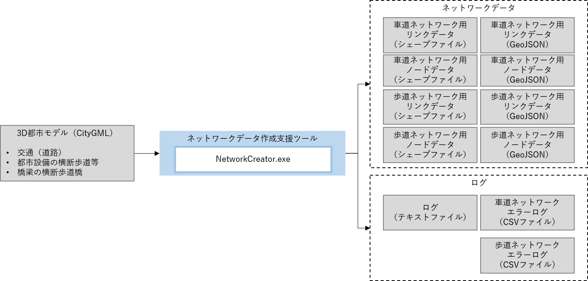
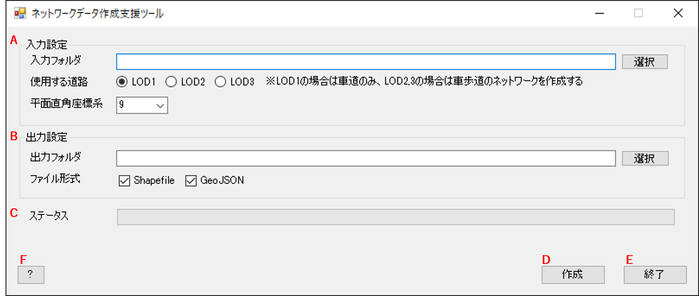
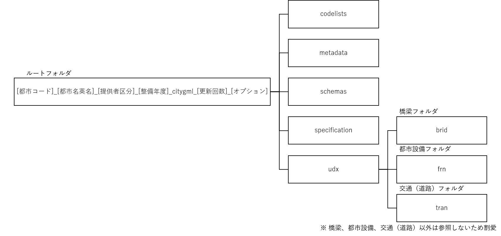

# 操作マニュアル

## 1 本書について

本書では、ネットワークデータ作成支援ツールの操作手順について記載しています。

## 2 ツール概要

本ツールは、3D都市モデル（交通（道路）、橋梁、都市設備）を使用して、車道ネットワーク及び歩道ネットワークデータの作成を行います。

入力データとして使用可能な3D都市モデルの詳細度は以下のとおりです。

| 3D都市モデル | 対応詳細度 |
| ----------- | ------------- |
| 交通（道路） | LOD1、LOD2、LOD3.0 - LOD3.3 |
| 橋梁 | LOD2.0、LOD2.1 |
| 都市設備 | LOD2、LOD3 |

## 3 使い方

### 3-1 画面の説明

本ツールの実行ファイル「NetworkCreator.exe」を実行すると以下の画面が表示されます。

|          |  項目         | 説明                                        |
| -------- | ------------ | ------------------------------------------- |
|    A     | 入力設定      | 入力する3D都市モデルの指定や3D都市モデルに対応する平面直角座標系を設定します。|
|    B     | 出力設定      | ネットワークデータの出力先やネットワークデータのファイル形式を設定します。|
|    C     | ステータス    |  ネットワークデータ作成中の進捗状況を表示します。|
|    D     | 作成         | ネットワークデータの作成を開始します。          |
|    E     | 終了         | アプリケーションを終了します。                 |
|    F     | ?           | 操作マニュアルを表示します。                   |

### 3-2 入力設定

① 入力フォルダ

3D都市モデルデータのルートフォルダを設定します。 \
「選択」ボタンを押下するとフォルダ選択のダイアログが表示され、ダイアログの中で選択したパスがテキストボックスに入力されます。 \
3D都市モデルデータは、[3D都市モデル（Project PLATEAU) ポータルサイト](https://www.geospatial.jp/ckan/dataset/plateau)から入手可能です。本ツールでは、[3D都市モデル標準製品仕様書](https://www.mlit.go.jp/plateau/libraries/handbooks/) 第3版（第3版の最終版は第3.5版）に準拠した3D都市モデルデータを入力対象としています。

本ツールが入力を想定している3D都市モデルデータの構成は以下のとおりです。

② 使用する道路

ネットワークデータを作成する際に使用する交通（道路）のモデルの詳細度を設定します。 \
[3D都市モデル標準製品仕様書 第3.5版](https://www.mlit.go.jp/plateau/file/libraries/doc/plateau_doc_0001_ver03.pdf)では、LOD3はLOD3.0 - LOD3.4まで定義されていますが、本ツールではLOD3.0 - LOD3.3を入力対象とします。 \
「使用する道路」において「LOD3」を選択した場合、本ツールは読み込んだ交通（道路）モデルに記載されているLOD3の詳細な区分（LOD3.0 - LOD3.4）を基にネットワークデータの作成を行います。

| 項目 | 説明                                                                   |
| ---- | --------------------------------------------------------------------- |
| LOD1 | LOD1交通（道路）モデルを使用して車道ネットワークデータを作成します。        |
| LOD2 | LOD2交通（道路）モデルを使用して車道及び歩道ネットワークデータを作成します。 |
| LOD3 | LOD3交通（道路）モデルを使用して車道及び歩道ネットワークデータを作成します。 |

③ 平面直角座標系

「入力フォルダ」で指定した3D都市モデルに該当する平面直角座標系の系番号を指定します。 \
入力データである3D都市モデルは、日本測地系2011における経緯度座標系と東京湾平均海面を基準とする標高の複合座標参照系（EPSGコード:6697）で記載されていますが、本ツールでは平面直角座標系で内部処理を行っているため、平面直角座標系の系番号の指定が必要となります。 \
引用 : [国土交通省 国土地理院 平面直角座標系（平成十四年国土交通省告示第九号）](https://www.gsi.go.jp/LAW/heimencho.html)

### 3-3 出力設定

① 出力フォルダ

ネットワークデータの出力先フォルダを設定します。 \
「選択」ボタンを押下するとフォルダ選択のダイアログが表示され、ダイアログの中で選択したパスがテキストボックスに入力されます。

② ファイル形式

ネットワークデータのファイル形式を選択します。 \
ファイル形式は、「Shapefile」（シェープファイル）及び「GeoJSON」のどちらか又は両方を選択可能です。

### 3-4 ネットワークデータの作成

入力設定と出力設定の完了後に作成ボタンを押下すると、ネットワークデータの作成を開始します。 \
ネットワークデータの作成が完了すると、終了メッセージボックスが表示されます。\
作成されたネットワークデータの仕様に関しては、[こちら](./outputDataSpec.md)を参照してください。
