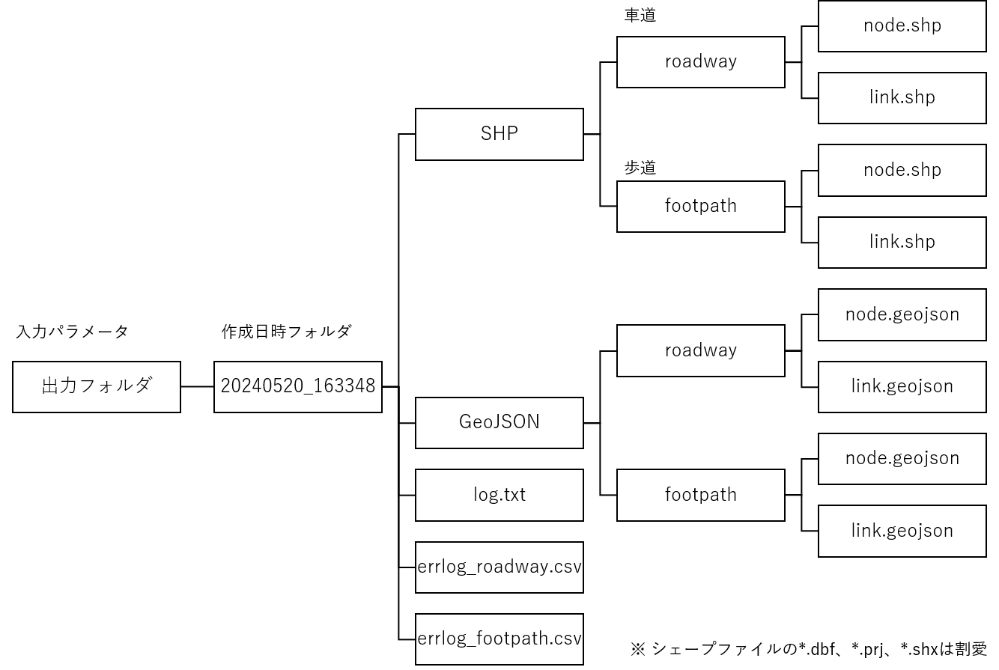
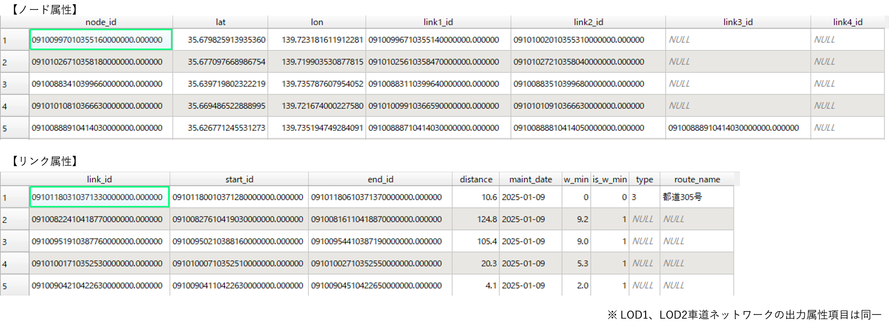
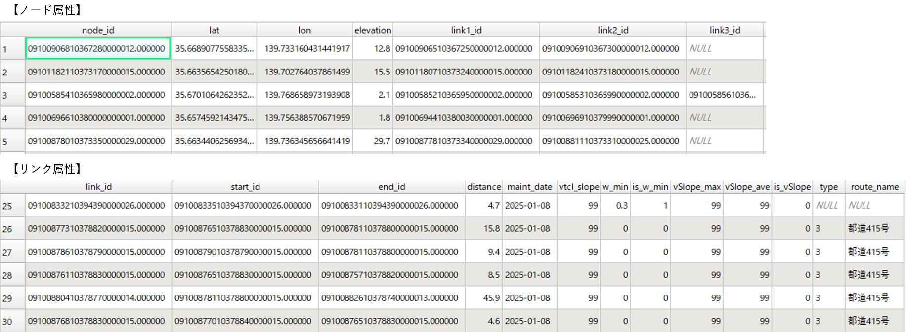
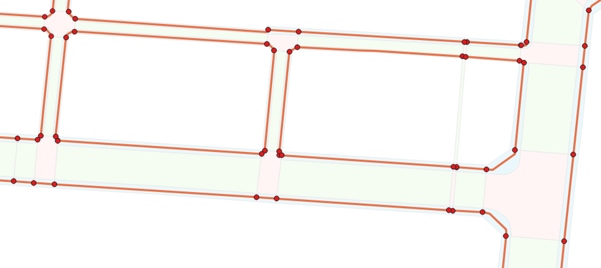
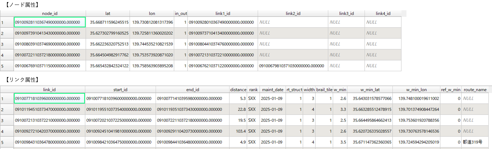
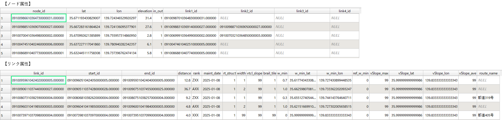
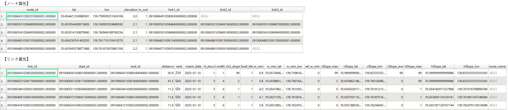
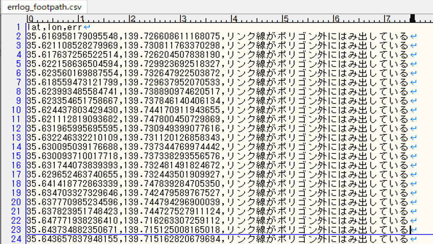

# 操作マニュアル

## 1 本書について

本書では、ネットワークデータ作成支援ツール（以下「本ツール」という。）の操作手順について記載しています。

## 2 ツール概要

本ツールは、3D都市モデル（交通（道路）、橋梁、都市設備）を使用して、車道ネットワーク及び歩道ネットワークデータの作成を行います。

## 3 使い方

### 3-1 画面

本ツールの実行ファイル「NetworkCreator.exe」を実行すると以下の画面が表示されます。

|          |  項目         | 説明                                        |
| -------- | ------------ | ------------------------------------------- |
|    A     | 入力設定      | 作成するネットワークデータの入力設定項目です。  |
|    B     | 出力設定      | 作成するネットワークデータの出力設定項目です。  |
|    C     | ステータス    |  ネットワークデータ作成中の進捗状況を表示します。|
|    D     | 作成         | ネットワークデータの作成を開始します。          |
|    E     | 終了         | アプリケーションを終了します。                 |
|    F     | ?           | 操作マニュアルを表示します。                   |

### 3-2 入力設定

① 入力フォルダ

3D都市モデルデータのルートフォルダを設定します。 \
「選択」ボタンを押下するとフォルダ選択のダイアログが表示され、ダイアログの中で選択したパスがテキストボックスに入力されます。 \
3D都市モデルデータは、[3D都市モデル（Project PLATEAU) ポータルサイト](https://www.geospatial.jp/ckan/dataset/plateau)から入手可能です。本ツールでは、[3D都市モデル標準製品仕様書](https://www.mlit.go.jp/plateau/libraries/handbooks/) 第3版（第3版の最終版は第3.5版）に準拠した3D都市モデルデータを入力対象としています。

本ツールが入力を想定している3D都市モデルデータの構成は以下のとおりです。

② 使用する道路

ネットワークデータを作成する際に使用する交通（道路）のモデルの詳細度を設定します。 \
[3D都市モデル標準製品仕様書 第3.5版](https://www.mlit.go.jp/plateau/file/libraries/doc/plateau_doc_0001_ver03.pdf)では、LOD3はLOD3.0 - LOD3.4まで定義されていますが、本ツールではLOD3.0 - LOD3.3を入力対象とします。 \
「使用する道路」において「LOD3」を選択した場合、本ツールは読み込んだ交通（道路）モデルに記載されているLOD3の詳細な区分（LOD3.0 - LOD3.4）を基にネットワークデータの作成を行います。

| 項目 | 説明                                                                   |
| ---- | --------------------------------------------------------------------- |
| LOD1 | LOD1交通（道路）モデルを使用して車道ネットワークデータを作成します。        |
| LOD2 | LOD2交通（道路）モデルを使用して車道及び歩道ネットワークデータを作成します。 |
| LOD3 | LOD3交通（道路）モデルを使用して車道及び歩道ネットワークデータを作成します。 |

③ 平面直角座標系

「入力フォルダ」で指定した3D都市モデルに該当する平面直角座標系の系番号を指定します。 \
入力データである3D都市モデルは、日本測地系2011における経緯度座標系と東京湾平均海面を基準とする標高の複合座標参照系（EPSGコード:6697）で記載されていますが、本ツールでは平面直角座標系で内部処理を行っているため、平面直角座標系の系番号の指定が必要となります。 \
引用 : [国土交通省 国土地理院 平面直角座標系（平成十四年国土交通省告示第九号）](https://www.gsi.go.jp/LAW/heimencho.html)

### 3-3 出力設定

① 出力フォルダ

ネットワークデータの出力先フォルダを設定します。 \
「選択」ボタンを押下するとフォルダ選択のダイアログが表示され、ダイアログの中で選択したパスがテキストボックスに入力されます。

② ファイル形式

ネットワークデータのファイル形式を選択します。 \
ファイル形式は、「Shapefile」（シェープファイル）及び「GeoJSON」のどちらか又は両方を選択可能です。

### 3-4 ネットワークデータの作成

入力設定と出力設定の完了後に作成ボタンを押下すると、ネットワークデータの作成を開始します。 \
ネットワークデータの作成が完了すると、終了メッセージボックスが表示されます。

## 4 出力データ

本ツールの出力データは以下のとおりです。

| 項目                 | 説明                                                    |
| -------------------- | ------------------------------------------------------- |
| 車道ネットワークデータ | 車道ネットワークのノードデータとリンクデータ。              |
| 歩道ネットワークデータ | 歩道ネットワークのノードデータとリンクデータ。              |
| 動作ログ              | 本ツールの動作時のログメッセージを記載したテキストファイル。 |
| エラーログ            | 車道及び歩道ネットワークのエラー箇所を記載したCSVファイル。  |

出力データは以下の構成で出力されます。

### 4-1 ネットワークデータ

#### 4-1-1 車道ネットワークデータ

車道ネットワークデータのノードデータとリンクデータは、出力設定で指定されたファイル形式で出力します。 \
出力先は以下のとおりです。

| ファイル形式 | 出力先 |
| ----- | ----- |
| Shapefile（シェープファイル） | 出力フォルダ/作成日時フォルダ/SHP/roadway |
| GeoJSON | 出力フォルダ/作成日時フォルダ/GeoJSON/roadway |

出力ファイルの文字コードは、Shapefile(シェープファイル)の場合はShift_JIS、GeoJSONの場合はUTF-8です。

ノードデータとリンクデータの幾何情報の座標系は、入力設定の「使用する道路」で指定した交通（道路）の詳細度によって変動します。

| 交通（道路）の詳細度 | 幾何情報の座標系 |
| ----- | ----- |
| LOD1 | 日本測地系2011における経緯度座標系（EPSGコード:6668） |
| LOD2 | 日本測地系2011における経緯度座標系（EPSGコード:6668） |
| LOD3 | 日本測地系2011における経緯度座標系と東京湾平均海面を基準とする標高の複合座標参照系（EPSGコード:6697） |

ノードデータとリンクデータに付与される属性情報は、入力設定の「使用する道路」で指定した交通（道路）の詳細度によって変動します。
詳細については[4-1-3 属性情報](#4-1-3-属性情報)を参照してください。

【車道ネットワークの幾何形状サンプル】

【車道ネットワークの属性情報サンプル（LOD1、LOD2）】

【車道ネットワークの属性情報サンプル（LOD3）】

#### 4-1-2 歩道ネットワークデータ

歩道ネットワークデータのノードデータとリンクデータは、出力設定で指定されたファイル形式で出力します。 \
出力先は以下のとおりです。

| ファイル形式 | 出力先 |
| ----- | ----- |
| Shapefile（シェープファイル） | 出力フォルダ/作成日時フォルダ/SHP/footpath |
| GeoJSON | 出力フォルダ/作成日時フォルダ/GeoJSON/footpath |

出力ファイルの文字コードは、Shapefile(シェープファイル)の場合はShift_JIS、GeoJSONの場合はUTF-8です。

ノードデータとリンクデータの幾何情報の座標系は、入力設定の「使用する道路」で指定した交通（道路）の詳細度によって変動します。

| 交通（道路）の詳細度 | 幾何情報の座標系 |
| ----- | ----- |
| LOD2 | 日本測地系2011における経緯度座標系（EPSGコード:6668） |
| LOD3 | 日本測地系2011における経緯度座標系と東京湾平均海面を基準とする標高の複合座標参照系（EPSGコード:6697） |

ノードデータとリンクデータに付与される属性情報は、入力設定の「使用する道路」で指定した交通（道路）の詳細度によって変動します。
詳細については[4-1-3 属性情報](#4-1-3-属性情報)を参照してください。

【歩道ネットワークの幾何形状サンプル】

【車道ネットワークの属性情報サンプル（LOD2）】

【車道ネットワークの属性情報サンプル（LOD3.0 - LOD3.1）】

【車道ネットワークの属性情報サンプル（LOD3.2 - LOD3.3）】

#### 4-1-3 属性情報

以下にネットワークデータ（ノードデータとリンクデータ）の属性情報の一覧、及び、入力設定の「使用する道路」で指定した交通（道路）の詳細度によって変動する属性の有無の一覧を記載します。

【ノードデータの属性情報】

| No | 属性 | 属性名 | 説明 |
| ----- | ----- | ----- | ----- |
| 1 | ノードID | node_id | 座標点の平面直角座標系の系番号(2桁)、平面直角座標系のxyz座標の整数部(符号1桁、座標値6桁)、連番(6桁)を順番に記載した文字列。   平面直角座標系の系番号とxyz座標を整数部とし、連番部分を小数部としてピリオドで区切ります。   なお、座標値の符号は正を0、負を1とします。 |
| 2 | 緯度 | lat | ノード座標の緯度を記載します。   座標系は日本測地系2011における経緯度座標系です。 |
| 3 | 経度 | lon | ノード座標の経度を記載します。   座標系は日本測地系2011における経緯度座標系です。 |
| 4 | 標高値 | elevation | ノード座標の標高値を記載します。   LOD3.0以上の交通（道路）からネットワークを作成した場合に付与します。 |
| 5 | 施設内外区分 | in_out | 歩道ネットワークの場合に付与し、値は1（施設外）固定とします。   設定可能な値は以下のとおりです。   1:施設外   2:施設内外の境界   3:施設内 |
| 6 | 接続リンクID | link_id | ノードが接続しているリンクのIDを記載します。   接続しているリンク数によってlink1_id、link2_id、…、link99_idのように属性数が増加します。 |

【リンクデータの属性情報】

| No | 属性 | 属性名 | 説明|
|----- | ----- | ----- | ----- |
| 1 | リンクID | link_id | リンク中央付近の座標点（リンクが2点間からなる線分の場合は線分の中点、3点以上のポリラインの場合は座標インデックスが中央となる座標点）の平面直角座標系の系番号(2桁)、平面直角座標系のxyz座標の整数部(符号1桁、座標値6桁)、連番(6桁)を順番に記載した文字列。   平面直角座標系の系番号とxyz座標を整数部とし、連番部分を小数部としてピリオドで区切ります。なお、座標値の符号は正を0、負を1とします。 |
| 2 | 起点ノードID | start_id | リンクの起点となるノードのIDを記載します。 |
| 3 | 終点ノードID | end_id | リンクの終点となるノードのIDを記載します。 |
| 4 | リンク延長 | distance | リンクの延長を小数点以下第1位までの精度で記載します。   単位はメートル。 |
| 5 | ランク区分 | rank | 歩道ネットワークの場合に付与し、幅員、縦断勾配、段差を示すランク（S/A/B/C/Z/X）を順に並べて英字3文字で記載します。   各ランクの判定方法は以下のとおりです。   【幅員】   S:最小幅員が2m以上   A:最小幅員が1m以上、2m未満   B:設定なし   C:設定なし   Z:最小幅員が1m未満   X:不明   【縦断勾配】   S:最大縦断勾配が0%（平坦）  A:最大縦断勾配が0%より大きく5%以下   B:最大縦断勾配5%より大きく8%以下   C:最大縦断勾配8%より大きく18%以下   Z:最大縦断勾配が18%より大きい   X:不明  【段差】  段差の計測は行わないためX（不明）を付与します。 |
| 6 | リンク作成・更新日 | maint_date | リンクデータを作成した日付を記載します。 |
| 7 | 経路構造 | rt_struct | 歩道ネットワークの場合に付与します。   設定値は以下のとおりですが、入力として使用する3D都市モデルの関係上、付与可能な設定値は、1、3、6、99です。   1:車道と歩道の物理的な分離あり   2:車道と歩道の物理的な分離なし   3:横断歩道   4:横断歩道の路面表示の無い道路の横断部   5:地下通路   6:歩道橋   7:施設内通路   8:その他の経路の構造   99:不明 |
| 8 | 幅員（コード値） | width | 歩道ネットワークの場合に付与します。   設定値は以下のとおりです。   1:1.0未満   2:1.0m以上、2.0m未満   3:2.0m以上、3.0m未満   4:3.0m以上   99:不明 |
| 9 | 縦断勾配（コード値） | vtcl_slope | LOD3.0以上の交通（道路）からネットワークを作成した場合に付与します。  設定値は以下のとおりです。   1:0%   2:0%より大きい、5%以下   3:5%より大きい、8%以下（起点より終点が高い）   4:5%より大きい、8%以下（起点より終点が低い）  5:8%より大きい、18%以下（起点より終点が高い）   6:8%より大きい、18%以下（起点より終点が低い）   7:18%より大きい（起点より終点が高い）   8:18%より大きい（起点より終点が低い）   99:不明 |
| 10 | 点字ブロックの有無 | brail_tile | 歩道ネットワークの場合に付与します。   設定値は以下のとおりです。   1:視覚障害者誘導用ブロック等なし   2:視覚障害者誘導用ブロック等あり   99:不明 
| 11 | 最小幅員 | w_min | リンク内の幅員の最小値を小数点以下第1位までの精度で記載します。   単位はメートル。|
| 12 | 最小幅員緯度 | w_min_lat | 歩道ネットワークの場合に付与します。   最小幅員地点の緯度を記載します。   座標系は日本測地系2011における経緯度座標系です。 |
| 13 | 最小幅員経度 | w_min_lon | 歩道ネットワークの場合に付与します。   最小幅員地点の経度を記載します。   座標系は日本測地系2011における経緯度座標系です。 |
| 14 | 最小幅員有効フラグ | is_w_min | 車道ネットワークの場合に付与します。   最小幅員属性が有効値である場合は1、無効値である場合は0とします。 |
| 15 | 最小幅員参考値フラグ | ref_w_min | 歩道ネットワークの場合に付与します。   歩道ネットワークにおいて、車道交差部内の歩道の幅員が正しく求められない可能性があるため、正しい値ではない可能性がある最小幅員に関しては参考値として判断ができるようにこの属性を付与します。   最小幅員属性が参考値である場合は1、非参考値である場合は0とします。 |
| 16 | 最大縦断勾配 | vSlope_max | LOD3.0以上の交通（道路）からネットワークを作成した場合に付与します。   リンク内の縦断勾配の最大値を整数で記載します。   単位はパーセント。 |
| 17 | 最大縦断勾配緯度 | vSlope_lat | LOD3.0以上の交通（道路）からネットワークを作成した歩道ネットワークの場合に付与します。   リンク内の最大縦断勾配地点の緯度を記載します。   座標系は日本測地系2011における経緯度座標系です。 |
| 18 | 最大縦断勾配経度 | vSlope_lon | LOD3.0以上の交通（道路）からネットワークを作成した歩道ネットワークの場合に付与します。   リンク内の最大縦断勾配地点の経度を記載します。   座標系は日本測地系2011における経緯度座標系です。 |
| 19 | 平均縦断勾配 | vSlope_ave | LOD3.0以上の交通（道路）からネットワークを作成したネットワークの場合に付与します。   リンク内の縦断勾配の平均値を整数で記載します。   単位はパーセント。 |
| 20 | 縦断勾配有効フラグ | is_vSlope | LOD3.0以上の交通（道路）からネットワークを作成した車道ネットワークの場合に付与します。   最大縦断勾配と平均縦断勾配属性が有効値である場合は1、無効値である場合は0とします。 |
| 21 | 最大横断勾配 | hSlope_max | LOD3.2以上の交通（道路）からネットワークを作成した歩道ネットワークの場合に付与します。   リンク内の横断勾配の最大値を整数で記載します。   単位はパーセント。 |
| 22 | 最大横断勾配緯度 | hSlope_lat | LOD3.2以上の交通（道路）からネットワークを作成した歩道ネットワークの場合に付与します。   リンク内の最大横断勾配地点の緯度を記載します。   座標系は日本測地系2011における経緯度座標系です。 |
| 23 | 最大横断勾配経度 | hSlope_lon | LOD3.2以上の交通（道路）からネットワークを作成した歩道ネットワークの場合に付与します。   リンク内の最大横断勾配地点の経度を記載します。   座標系は日本測地系2011における経緯度座標系です。 |
| 24 | 道路の区分 | type | 車道ネットワークの場合に付与します。   交通（道路）CityGMLに記載されている道路の区分（tran:Roadのtran:function）を記載します。 |
| 25 | 通り名、路線名 | route_name | 交通（道路）CityGMLに記載されている路線名（tran:Roadのgml:name）を記載します。 |

【交通（道路）の詳細度によるノードデータの属性情報の有無】

| No | 属性 | 車道（LOD1） | 車道（LOD2） | 車道（LOD3.0 - 3.3） | 歩道（LOD2） | 歩道（LOD3.0 - 3.3） |
| ----- | ----- | ----- | ----- | ----- | ----- | ----- |
| 1 | ノードID | ○ | ○ | ○ | ○ | ○ |
| 2 | 緯度 | ○ | ○ | ○ | ○ | ○ |
| 3 | 経度 | ○ | ○ | ○ | ○ | ○ |
| 4 | 標高値 | × | × | ○ | × | ○ |
| 5 | 施設内外区分 | × | × | × | ○ | ○ |
| 6 | 接続リンクID | ○ | ○ | ○ | ○ | ○ |

【交通（道路）の詳細度によるリンクデータの属性情報の有無】

| No | 属性 | 車道（LOD1） | 車道（LOD2） | 車道（LOD3.0 - 3.3） | 歩道（LOD2） | 歩道（LOD3.0 - 3.1） | 歩道（LOD3.2 - 3.3） |
| ----- | ----- | ----- | ----- | ----- | ----- | ----- | ----- |
| 1 | リンクID | ○ | ○ | ○ | ○ | ○ | ○ |
| 2 | 起点ノードID | ○ | ○ | ○ | ○ | ○ | ○ |
| 3 | 終点ノードID | ○ | ○ | ○ | ○ | ○ | ○ |
| 4 | リンク延長 | ○ | ○ | ○ | ○ | ○ | ○ |
| 5 | ランク区分 | × | × | × | ○ | ○ | ○ |
| 6 | リンク作成・更新日 | ○ | ○ | ○ | ○ | ○ | ○ |
| 7 | 経路構造 | × | × | × | ○ | ○ | ○ |
| 8 | 幅員（コード値） | × | × | × | ○ | ○ | ○ |
| 9 | 縦断勾配（コード値） | × | × | ○ | × | ○ | ○ |
| 10 | 点字ブロックの有無 | × | × | × | ○ | ○ | ○ |
| 11 | 最小幅員 | ○ | ○ | ○ | ○ | ○ | ○ |
| 12 | 最小幅員緯度 | × | × | × | ○ | ○ | ○ |
| 13 | 最小幅員経度 | × | × | × | ○ | ○ | ○ |
| 14 | 最小幅員有効フラグ | ○ | ○ | ○ | × | × | × |
| 15 | 最小幅員参考値フラグ | × | × | × | ○ | ○ | ○ |
| 16 | 最大縦断勾配 | × | × | ○ | × | ○ | ○ |
| 17 | 最大縦断勾配緯度 | × | × | × | × | ○ | ○ |
| 18 | 最大縦断勾配経度 | × | × | × | × | ○ | ○ |
| 19 | 平均縦断勾配 | × | × | ○ | × | ○ | ○ |
| 20 | 縦断勾配有効フラグ | × | × | ○ | × | × | × |
| 21 | 最大横断勾配 | × | × | × | × | × | ○ |
| 22 | 最大横断勾配緯度 | × | × | × | × | × | ○ |
| 23 | 最大横断勾配経度 | × | × | × | × | × | ○ |
| 24 | 道路の区分 | ○ | ○ | ○ | × | × | × |
| 25 | 通り名、路線名 | ○ | ○ | ○ | ○ | ○ | ○ |

### 4-3 動作ログ

ネットワークデータ作成時の動作ログを以下に出力します。\
出力フォルダ/作成日時フォルダ/log.txt

ログファイルの文字コードはUTF-8です。 \
動作ログの記載内容は以下のとおりです。

|   | 説明                                                |
| - | -------------------------------------------------- |
| ① | ネットワークデータ作成時の入出力設定を記載しています。  |
| ② | ネットワークデータ作成時の動作ログを記載しています。    |
| ③ | ネットワークデータ作成に要した処理時間を記載しています。 |

### 4-4 エラーログ

エラーログは作成したネットワークデータのエラー地点の緯度経度情報とエラー内容を記載したCSVファイルです。なお、エラー地点の座標系は日本測地系2011における経緯度座標系（EPSGコード:6668）です。 \
エラーログは、車道ネットワークと歩道ネットワークごとにログファイルを以下に出力します。

| ネットワーク種別 | 出力先 |
| ----- | ----- |
| 車道ネットワーク | 出力フォルダ/作成日時フォルダ/errlog_roadway.csv |
| 歩道ネットワーク | 出力フォルダ/作成日時フォルダ/errlog_footpath.csv |

ログファイルの文字コードはUTF-8です。 \
エラーログの記載内容は以下のとおりです。

【エラー内容】

| No | エラー内容 | 車道ネットワークでの確認有無 | 歩道ネットワークでの確認有無 |
| -- | ----- | ----- | ----- |
| 1  | リンク線がポリゴン外にはみ出している | ○ | ○ |
| 2  | リンク線の取得に失敗 | ○ | ○ |
| 3  | 未接続の横断歩道のため要確認 | × | ○ |
| 4  | 未接続の横断歩道橋のため要確認 | × | ○ |

